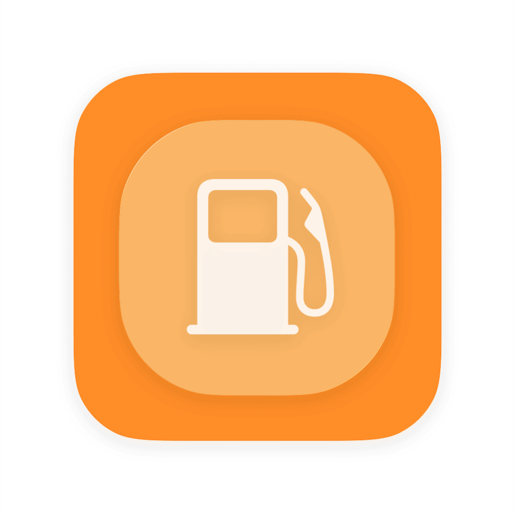
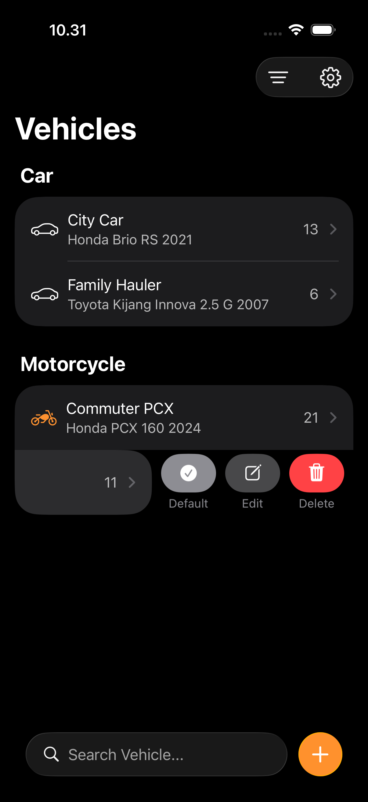
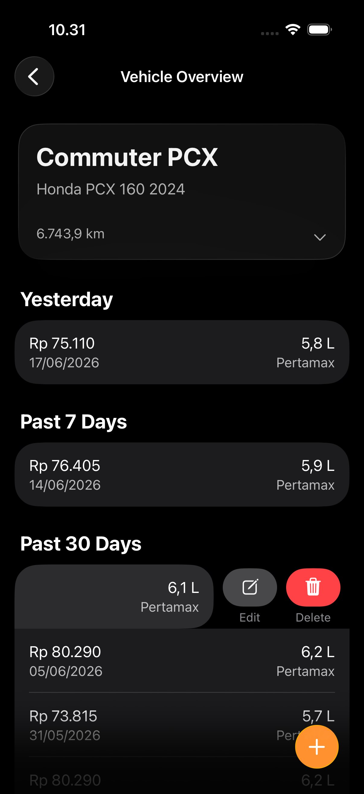
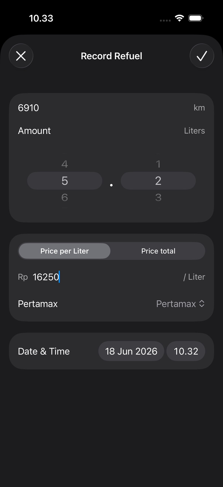
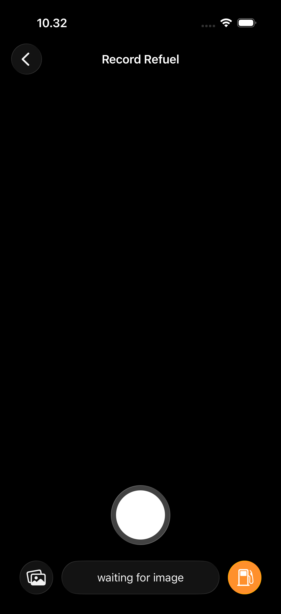

# FuelLog

A native, high-performance iOS application built to track, organize, and analyze vehicle fuel logs and expenses. This project was developed as a deep dive into modern SwiftUI patterns, local data persistence, and streamlining mileage tracking for daily commutes or long-distance touring.

  

## Project Description

FuelLog serves as a streamlined interface for managing your vehicle's fuel history. Beyond simple data entry, the app focuses on a seamless user experience through intuitive form flows, vehicle profile management, and automated receipt scanning. It was designed to explore the boundaries of SwiftUI's declarative syntax when handling user input, camera integrations, and local data management.

  
  
  
  

> **⚠️ Disclaimer on Image Extraction**
> The current data extraction from the camera and photo library is highly inaccurate. It currently relies on a multi-step process utilizing standard OCR followed by a foundation model. The intended multimodal foundation model required for high-accuracy extraction is tied to the iOS 27 beta, which is currently unavailable to me. Expect suboptimal accuracy until this can be updated.

## Tech Stack

* **Framework**: SwiftUI
* **Language**: Swift 6
* **Architecture**: MVVM
* **Persistence**: Local Storage 

## Key Features

* **Vehicle Profiles**: Manage multiple vehicles with detailed tracking for each.
* **Fuel Logging**: Record fuel stops, pricing, and quantities with a streamlined input flow.
* **Receipt Scanning**: Attempt automated logging via camera and photo extraction (see disclaimer above).
* **Responsive Layout**: A clean, fluid system that adapts perfectly to various iPhone screen sizes.

## License

This project is licensed under the GNU Affero General Public License v3.0 (AGPL-3.0). This ensures that the spirit of open-source collaboration is maintained. See the LICENSE file for full details.

> **AGPL-3.0 License**
> This project is open-source under the terms of the [AGPL-3.0 License](LICENSE).

---

Created by **Muhammad Akbar Reishandy**

<kbd>[Email](mailto:akbar@reishandy.id)</kbd>
<kbd>[Website](https://reishandy.id)</kbd>
<kbd>[GitHub](https://github.com/Reishandy)</kbd>
<kbd>[LinkedIn](https://www.linkedin.com/in/reishandy/)</kbd>
